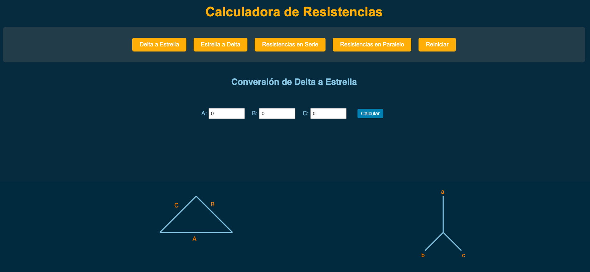

# Calculadora de Resistencias

Esta aplicación es una herramienta interactiva que te permite calcular el valor total de resistencias eléctricas conectadas en serie o paralelo. Es ideal para estudiantes, ingenieros o cualquier persona interesada en circuitos eléctricos.

## Tecnologías Utilizadas

- **React**: Framework de JavaScript para la creación de interfaces de usuario dinámicas.
- **CSS**: Para estilizar la aplicación con un diseño limpio y responsivo.
- **JavaScript**: Lógica principal de los cálculos de las resistencias.
- **HTML**: Estructura base de la aplicación.
- **GitHub Pages**: Para el despliegue de la aplicación en línea.

## Características

- **Modo Serie**: Calcula la resistencia equivalente para resistencias conectadas en serie.
- **Modo Paralelo**: Calcula la resistencia equivalente para resistencias conectadas en paralelo.
- **Interfaz amigable**: Fácil de usar, con un diseño responsivo adaptado para dispositivos móviles y de escritorio.
- **Animaciones suaves**: Efectos visuales para mejorar la experiencia del usuario.

## Ver la Aplicación en Línea

Haz clic aquí para acceder a la calculadora:  
[Calculadora de Resistencias](https://nova-cz.github.io/Calculadora-Resistencias/)

## Scripts Disponibles

En el directorio del proyecto, puedes ejecutar los siguientes comandos:

### `npm start`

Ejecuta la aplicación en modo de desarrollo.\
Abre [http://localhost:3000](http://localhost:3000) para verla en tu navegador.

La página se recargará automáticamente si haces cambios en el código.\
También verás errores y advertencias en la consola.

### `npm run build`

Construye la aplicación para producción en la carpeta `build`.\
Optimiza el código para un mejor rendimiento.

### `npm test`

Lanza el corredor de pruebas en modo interactivo.\
Consulta más información sobre [pruebas en React](https://facebook.github.io/create-react-app/docs/running-tests).

## Requisitos

Para ejecutar el proyecto localmente, necesitas:

- Node.js y npm instalados.
- Un navegador moderno.

## Estructura del Proyecto

- **`src/portada/portada.png`**: Imagen utilizada como portada en este README.

---

Si tienes alguna sugerencia o problema, no dudes en abrir un issue o contribuir al proyecto.

¡Gracias por usar la calculadora!
